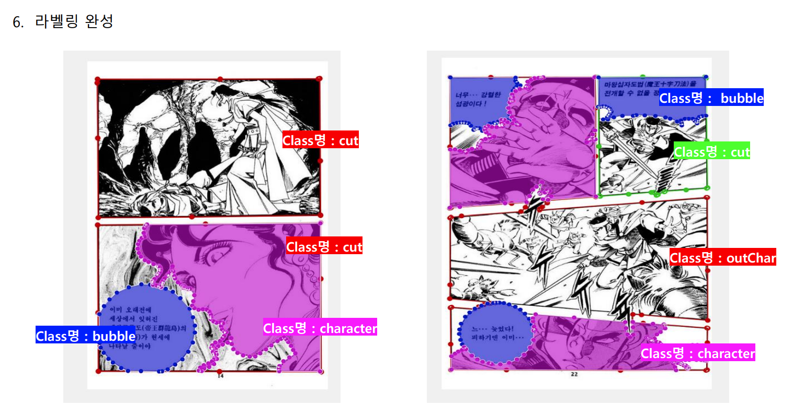
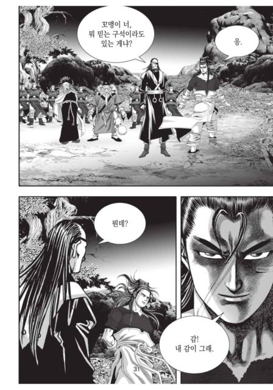
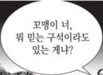
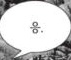
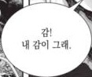
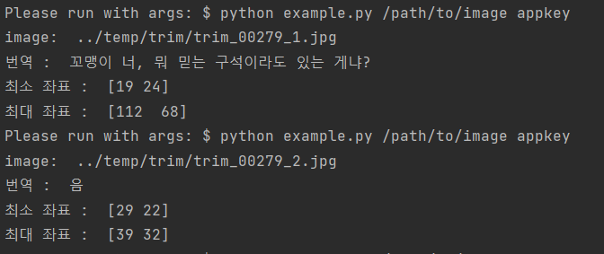
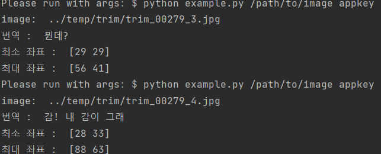

# OPEN CV를 활용하여 웹툰 이미지에서 좌표 데이터를 이용하여 말풍선 이미지 추출 

## labelme 툴을 이용한 좌표 데이터 생성

## main 파일에서 opencv_cut 파일을 import 하여 말풍선 이미지를 따로 저장하는 함수 구현

----
원본 이미지 파일

----
저장된 말풍선 이미지 파일

----

### 추가로 원본 이미지 파일에서 kakao ocr api 를 이용하여 
### 텍스트를 추출하였을 때 부족한 부분이 많았지만
### <u style="color:yellow">말풍선 이미지에서는 텍스트가 깔끔하게 추출 되었습니다</u>

----

